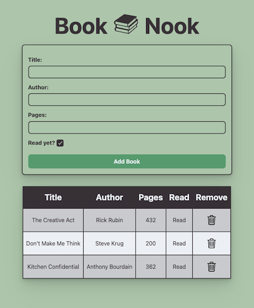

# Library App #

  

  

  <a href="https://scottwright-dev.github.io/odin-project-library/">Click here for demo</a>

### Description
The objective of this project is to demonstrate the benefits of modular code using object constructors to generate copies of an object. The project aims to provide a practical example of using object-oriented programming principles to manage a library of books, showcasing the advantages of modular code and object constructors for data storage and manipulation via the DOM.

### Technologies used:
- JavaScript
- HTML
- CSS
- ESLint

### What I learnt

- Object constructors
- Data storage with objects
- Code modularity
- DOM manipulation

### Thoughts and Observations

Throughout this project, I gained valuable insights into the benefits of modular code using object constructors. By utilizing constructors, I was able to create more reusable and organized code, resulting in easier maintenance and extensibility.

One notable aspect of this project was my decision to implement ESLint for the first time. This tool helped me focus more on the logic of my code rather than getting caught up in syntax errors. It enhanced the overall quality of my code and ensured adherence to best practices.

Overall, this project allowed me to deepen my understanding of modular code, leverage tools such as ESLint, and make better decisions to improve the code readability and maintainability.

### Additional features/Enhancement ideas 
- Sorting: Implement sorting functionality for the book list, allowing users to sort alphabetically or by read status for better organization.
- Edit: Enable editing of book details directly within the library, allowing users to update titles, authors, pages, and read status.
- UI: Improve the UI by displaying book cover artwork for each book, making the interface more immersive and engaging.
- Notes: Introduce a notes section for users to add personal comments or recommendations about each book, enhancing the user experience and facilitating information tracking.
- Search: Implement a search bar to easily find books by title, author, or other relevant criteria, improving usability as the library grows larger.
 
### Credits
- Icons: <a href="https://ionic.io/ionicons">ionic.io</a> & <a href="https://www.pngitem.com/download/ibxwbw_stack-of-books-icon-transparent-book-icon-png/">pngitem.com</a>

